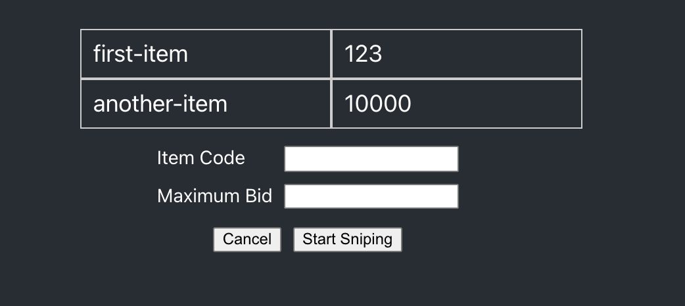

# 테스트 주도 개발로 배우는 객체 지향 설계와 실천 - 경매 스나이퍼 (패턴 연습)

[테스트 주도 개발로 배우는 객체 지향 설계와 실천](http://www.yes24.com/Product/Goods/9008455) 책에 나와있는 예시를 패턴과 리액트로 실습하기 위한 프로젝트입니다. 

 

# 프로젝트 진행사항
[x] 사용자 화면 UI 개발
[x] mock 데이터 리스트 구현과 버튼 추가
[] 단일 품목 경매 참여 
[] 테스트 코드 작성
